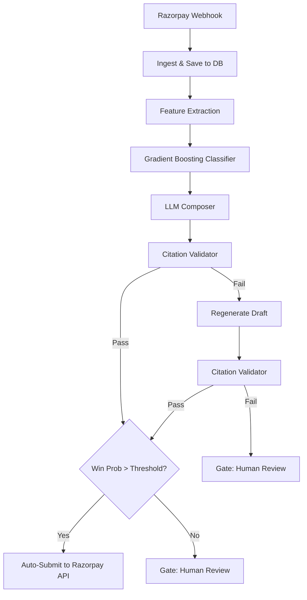

# Architecture

CaseClosed is an automated chargeback defense system that ingests webhook events, extracts evidentiary features, predicts win probabilities, and uses an LLM to generate formal rebuttals, guarded by a strict citation validator.

## System Flow

## Core Components

### 1. Ingestion & Feature Extraction (`ingest.py`, `features.py`)
Disputes arrive via webhook. We extract a flat `evidence_bundle` JSON object containing only verified facts (e.g., delivery timestamp, proof of delivery ID, chat receipts). Missing facts are strictly omitted to prevent LLM hallucination.

### 2. Probabilistic Gating (`model.py`, `gate.py`)
A `GradientBoostingClassifier` calibrated with `CalibratedClassifierCV` scores the dispute based on historical data. If the probability falls below our dynamically tuned threshold, the dispute is safely gated to human review.

### 3. LLM Composer (`compose.py`)
The composer uses the Gemini 2.5 Flash model with Temperature 0 to draft a rebuttal. The system prompt forces a rigid structure and mandates that every sentence end with a strict citation tag (e.g., `[source: shipment.pod_id]`).

### 4. Citation Validator (`validate.py`)
A deterministic Python validator parses every citation tag in the draft. It verifies that the cited key exists in the `evidence_bundle` and that critical exact-match strings (like tracking numbers or dates) appear verbatim in the sentence.

### 5. UI Dashboard (`api.py`, `index.html`)
A single-page application built with Vanilla JS serves as the merchant portal. It polls the FastAPI backend and displays disputes, allowing manual overrides for gated disputes.

## DECISIONS

**Why Supabase PostgreSQL over SQLite?**
While SQLite is excellent for local development, our synthetic data generation (`generator.py`) and fast API polling caused frequent database locks in WAL mode during testing. Moving to Supabase Postgres allowed us to handle concurrent webhooks without locking out the frontend dashboard.

**Why Gradient Boosting instead of LLM for decision making?**
We isolated decision-making (winning probability) from text generation (rebuttal drafting). LLMs are notoriously poor at statistically weighing historical risk factors (like a customer's prior dispute rate). We use a traditional Gradient Boosting model for the mathematical decision, reserving the LLM exclusively for drafting text.

**Why a deterministic Validator instead of an LLM-as-a-Judge?**
Using a second LLM to grade the first LLM is expensive and prone to recursive hallucinations. We designed our drafting prompt to output strict citation tags, allowing a 100% deterministic, ultra-fast Python regex script to guarantee that no fabricated data ever reaches Razorpay.

**Why Gemini 2.5 Flash?**
We opted for Gemini Flash over Pro. Since we stripped all reasoning responsibilities away from the LLM (handling logic via Gradient Boosting and validation via Python), we only needed a fast, cheap text-formatting engine. Flash easily met our structural prompt constraints at a fraction of the cost.
